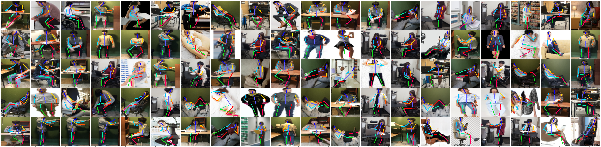
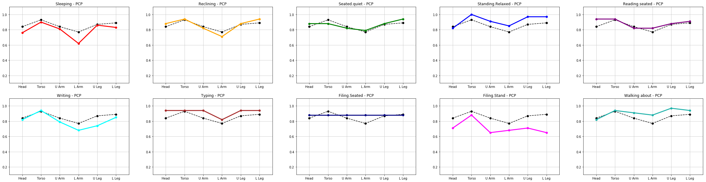

# Human Activities & Pose Estimation

HAPE (: Human Activity and Pose Estimation) is models that estimate single human's joints of indoor pictures and thier activities where they usually do at home and office. Each Activities have its own MET (Metabolic Equivalent of Task ) scores, which are finally aimed to estimate these scores. 

## Usage
> Will be updated soon

## Activity Categories
We have total 10 activities to be estimated.

* **Office Activities **
  `Walking about`, `Writing`, `Reading.seated`, `Typing`,`Filing.seated`, `Filing.stand` 
* **Resting **
`Reclining` ,`Seated.quiet`, `Sleeping`, `Standing.relaxed` 

 index | Activity | MET Score | Label Number
 ------|----------|-----------|-------------
 **01** | Sleeping | 0.7 | 0
 **02** | Reclining | 0.8 | 1
 **03** | Seated.Quiet | 1.0 | 2
 **04** | Standing.Relexed | 1.2 | 3
 **05** | Reading.Seated | 1.0 | 4
 **06** | Writing | 1.0 | 5
 **07** | Typing | 1.1 | 6
 **08** | Filing.Seated | 1.2 | 7
 **09** | Filing.Stand | 1.4 | 8
 **10** | Walking About | 1.7 | 9

## Test mPCP@0.5

 **Body Parts** | **mPCP@0.5** | 00 | 01 | 02 | 03 | 04 | 05 | 06 | 07 | 08 | 09 | 
 :--------: | :------: | :-: | :-: | :-: | :-: | :-: | :-: | :-: | :-: | :-: | :-: |
 Head | 0.84 | 0.76 | 0.88 | 0.88 | 0.82 | 0.94 | 0.82 | 0.94 | 0.88 | 0.71 | 0.82 |
 Torso | 0.93 | 0.90 | 0.94 | 0.88 | 1.00 | 0.94 | 0.94 | 0.94 | 0.88 | 0.88 | 0.94 |
 U Arm | 0.84 | 0.81 | 0.82 | 0.82 | 0.91 | 0.82 | 0.79 | 0.94 | 0.88 | 0.65 | 0.91 |
 L Arm | 0.77 | 0.62 | 0.71 | 0.79 | 0.85 | 0.82 | 0.0.68 | 0.82 | 0.88 | 0.68 | 0.88 |
 U Leg | 0.87 | 0.86 | 0.88 | 0.88 | 0.97 | 0.88 | 0.74 | 0.94 | 0.88 | 0.71 | 0.97 |
 L Leg | 0.89 | 0.83 | 0.94 | 0.94 | 0.97 | 0.91 | 0.85 | 0.94 | 0.88 | 0.65 | 0.94 |
 **MEAN** | **0.86** | **0.80** | **0.86** | **0.87** | **0.92** | **0.89** | **0.80** | **0.92** | **0.88** | **0.71** | **0.91** |

## Requirements
- **Python 3**
- **Tensorflow ≥ 1.5.0**
- **Tqdm ≥ 4.19.9**
- **Numpy ≥ 1.14.3**
- **Pandas ≥ 0.22.0**

## Acknowledgments

This research was supported by a grant from Infrastructure and Transportation Technology Promotion Research Program funded by Ministry of Land, Infrastructure and Transport of Korean government.

## References
- [DeepPose implementation on TensorFlow](https://github.com/asanakoy/deeppose_tf)
